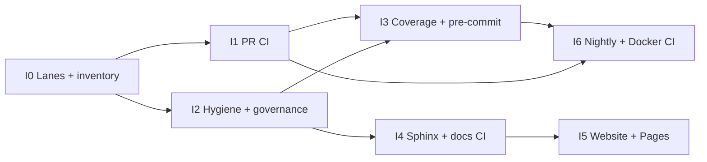

Type: PRODUCT
Authority: 0.9 infrastructure-wave delivery plan (CI, tests, docs hosting, release hygiene). Does not define runtime schemas or product UX — those stay in CONTRACT / usability docs. Companion to [ROADMAP.md](ROADMAP.md). Parity target: [glen-w/TranscriptX](https://github.com/glen-w/TranscriptX) maintainer infrastructure (not TranscriptX product features).

# 0.9 Infrastructure wave plan

**Status:** [~] in progress — bring Transcribe’s testing, CI, docs hosting, and release hygiene to TranscriptX-class maturity ahead of a credible public **1.0**. **I0–I4** landed (0.7.0 / 0.8.0 / Sphinx). Remaining: **I5–I6**.

**Thesis:** Product capability is ahead of operational infrastructure. Transcribe already has strong offline tests, acceptance gates, Markdown docs authority, Docker packaging, and local `# pre-release` / `# deep-test` agent SOPs — but lacks the **repo machinery** TranscriptX uses to keep every PR honest and every tag evidenced. This wave closes that gap without scheduling new analysis modules or stealing the usability wave’s **U2** product focus.

**Version note:** Package is **0.8.7** (I0–I4 plus post-U3 product cuts). The **0.9** label is a *programme* name (TranscriptX-style pre-1.0 stabilisation). Intermediate cuts: **0.7.0** = I0+I1; **0.8.0** = I2+I3 (landed); **0.8.5** = product patch; **0.8.6** = post-U3 product cut + **I4** Sphinx/CI docs; **0.8.7** = names/lexical detectors, Review/Library polish, circuit CLI honesty. **Wave exit + U2** enable the package cut **0.9.0**. Unfamiliar-user testing is **0.9-1** ([ROADMAP Path to 0.9.0](ROADMAP.md#path-to-090--09-1--10) · [dev/user_testing_0_9.md](dev/user_testing_0_9.md)) — **not** an I7 track. After 0.9-1: **1.0** freeze, then After 1.0 autobiography.

```text
Developer lanes     →     PR CI honesty     →     Release evidence
(Makefile + markers)      (matrix + hygiene)      (governance + hosted docs)
```

---

## 1. Goals and non-goals

### Goals

1. **One command vocabulary** — `make test-smoke` / `test-fast` / `test-contracts` / `docs` / `docker-smoke` match what CI and `# pre-release` run.
2. **PR confidence without Ollama** — every PR runs lint + offline smoke + default suite on a Python matrix; live Ollama stays environmental / deep-test only.
3. **Tag-ready evidence** — `docs/dev/release_governance.md` + `scripts/release/*` exist so `# pre-release` is local confidence and the governance doc is the real gate (TX pattern).
4. **Hosted docs path** — Sphinx builds the same Markdown corpus; GitHub Pages (and optional RTD scaffold) publish a guide without a second doc tree.
5. **Hygiene that fails loudly** — denylist/secrets, tracked-data allowlist, compose bind assert, stale refs, packaging smoke.

### Non-goals (explicit)

| Out of scope | Why |
|--------------|-----|
| New analysis modules / deferred reinterpretations | ROADMAP deferral stands |
| After 1.0 autobiography (context corpus, Slices, reconstruction) | Owned by [ROADMAP.md](ROADMAP.md) After 1.0; gated on 1.0 — this wave does not schedule it |
| Unfamiliar-user testing (**0.9-1**) | Owned by [ROADMAP.md](ROADMAP.md) Path to 0.9.0 / [dev/user_testing_0_9.md](dev/user_testing_0_9.md) — runs **after** the 0.9.0 cut; not I7 |
| Usability **U2** product copy (sample notebook, first-run docs path) | Owned by [usability_wave_plan.md](usability_wave_plan.md) — this wave may *host* docs, not write U2 content |
| TranscriptX Theme C workspaces / Vitest / Playwright browser packs | Different product surface |
| spaCy / `[nlp]` CI matrix lane | Transcribe has no spaCy install profile |
| PyPI publish automation | Local / Docker install remains the v1 distribution story |
| Full TX 0.9.x product themes (schema epoch, Guided mode, Overview chrome) | Wrong product; borrow *infra patterns* only |
| Blocking U2 on this wave | Parallel programme; do not serialize product usability behind CI scaffolding |

### Naming

| Say | Do not say |
|-----|------------|
| **0.9 infrastructure wave**, tracks **I0–I6** | “Wave 2”, “usability infra”, “TX port” |
| Release hygiene / governance | “Pre-release command is the tag authority” |
| Hosted guide (Sphinx / Pages) | “Rewrite all docs into RST” |

---

## 2. Parity baseline (TranscriptX → Transcribe)

Snapshot against [glen-w/TranscriptX](https://github.com/glen-w/TranscriptX) maintainer infrastructure (main at planning time).

| Area | TranscriptX | Transcribe today | Wave track |
|------|-------------|------------------|------------|
| **PR CI** | `.github/workflows/ci.yml`: compose-config, ruff critical, tests 3.10–3.12 (smoke → fast), release-checks | Landed **I1** + **I3** + **I4** docs job (0.7–0.8). Nightly / Docker image still **I6**; Pages **I5** | **I1**, **I3**, **I4**, **I6** |
| **Nightly** | `nightly.yml` → `make test-integration-core` | None | **I6** |
| **Pages** | `pages.yml` → website + Sphinx assemble | None | **I5** |
| **Makefile lanes** | Rich `test-*`, `docs`, `docs-gen`, `docker-smoke`, `pages-site` | `Makefile` + `tests/README.md` (**I0**, 0.7.0); `make docs` / `docs-clean` via `build_docs.sh` (**I4**); pages-site waits for I5 | **I0** |
| **Test docs** | `tests/README.md` lane budgets + marker policy | Landed **I0** | **I0** |
| **Markers** | smoke / contract / integration(_core|_extended) / heavy / gui_* / release_only / quarantined / requires_* | smoke / unit / integration / slow / requires_* / quarantined | **I0**, **I3** |
| **Coverage** | `.coveragerc` `fail_under = 70`; `make test-coverage` | Landed **I3** (`fail_under = 70`; UI omitted; current suite ~85%) | **I3** |
| **Pre-commit** | `config/.pre-commit-config.yaml` (hooks + black/ruff/mypy) | Root `.pre-commit-config.yaml` (**I3**; ruff critical + file hygiene; black/mypy still optional) | **I3** |
| **Release kit** | `scripts/release/*` + `scripts/secrets_check.sh` | Landed **I2** | **I2** |
| **Release governance** | `docs/dev/release_governance.md` + severity/ops docs | Landed **I2** (tag checklist; `# pre-release` stays local confidence) | **I2** |
| **Sphinx / RTD** | `docs/conf.py`, `.readthedocs.yml`, `.[docs]`, CI docs job | Landed **I4** (MyST over `docs/`; RTD hostname go-live still owner-gated) | **I4** |
| **Website** | `website/` + Pages | None | **I5** |
| **Workflow media** | `docs/workflows/` + `_static/workflows/` | Deferred | **I5** (optional after Pages) |
| **Issue templates** | bug / feature + config | None | **I6** |
| **Docs authority / archive / indexes** | Mature | Largely landed (CHANGELOG note) | keep; inventory pass in **I0** |
| **SECURITY / CONTRIBUTING / CHANGELOG** | Present | Present | deepen reporting link in **I2** |
| **Agent SOPs** | `# pre-release`, `# deep-test`, `# tests`, … | Present; wire to real scripts as they land | continuous |

**Already strong (do not rebuild):** offline default suite, acceptance suites (`tests/acceptance/hardening/`, `corpus/`, `ocr_lifecycle/`), fake Ollama doubles, Docker Compose loopback bind docs, contract + PRODUCT/ROADMAP doc model.

---

## 3. Tracks (I0–I6)

Prefer thematic cuts over fixed patch IDs. Suggested package bumps when cutting releases: land **I0–I1** before claiming CI honesty; land **I2** before the next public tag; land **I4–I5** before advertising a hosted guide. **I4** Sphinx/CI is landed; **I5** Pages still required before advertising a public landing.

### I0 — Developer lanes & inventory — [x] done

**Intent:** Single source of truth for how maintainers run tests/docs locally, matching what CI will call.

| Deliverable | Notes |
|-------------|--------|
| `Makefile` | Named test lanes plus `docs` / `docs-clean` (Sphinx via `build_docs.sh`, I4) |
| `tests/README.md` | Lane order, time budgets, marker policy matrix (TX `tests/README.md` shape, Transcribe markers) |
| Marker policy pass | Document when to use `smoke` vs default; keep `integration` = live Ollama only; optionally add `contract` / `release_only` markers without mass-retagging day one |
| Docs/script inventory | Light Phase-0A style: confirm root allowlist intent; list missing `scripts/release/*` as I2 backlog (do not invent a second docs tree) |
| `.[dev]` extras | Ensure pytest-timeout / pytest-cov (for I3) are declared when first used |

**Exit:** A new contributor can run the same named lanes CI will use; `developer_quickstart.md` links `tests/README.md`.

### I1 — PR CI (honesty gate) — [x] done

**Intent:** Every push/PR gets a TranscriptX-shaped minimum gate.

| Job (suggested) | Behaviour |
|-----------------|-----------|
| `compose-config` | Assert loopback bind / canonical Compose (script from I2; inline assert until then) |
| `lint` | Ruff critical selects on `src/transcribe` (E9/F63/F7/F82 + unused); do not gate on full black --check until drift is acceptable |
| `tests` | Matrix **3.10 / 3.11 / 3.12**; install `.[dev]` (and `.[ui]` if collection needs Streamlit); isolate temp data dirs; run smoke then default offline suite |
| concurrency | `cancel-in-progress` on PR ref |

**Env honesty:** disable network downloads / live LLM where applicable (`TRANSCRIBE_*` mirrors of TX’s offline CI env).

**Exit:** Green CI required on `main` PRs; README badge optional.

### I2 — Release hygiene kit + governance — [x] done

**Intent:** Make `# pre-release` script-backed and give tags an authoritative checklist.

| Deliverable | TX analogue |
|-------------|-------------|
| `scripts/secrets_check.sh` + denylist | `scripts/secrets_check.sh`, `scripts/release/check_denylist.py` |
| `scripts/release/stale_refs.sh` | Stale version / hostname / TODO gate |
| `scripts/release/check_tracked_data.py` + allowlist TOML | No surprise large/data commits |
| `scripts/release/assert_compose_bind.sh` | `127.0.0.1` publish honesty |
| `scripts/release/repo_hygiene_audit.py` | Root docs allowlist + archive banners (warn → strict subset) |
| `docs/dev/release_governance.md` | Manual next-tag checklist + evidence bundle |
| `docs/dev/dependency_audit.md` | CVE / waiver log (start thin) |
| SECURITY.md | Prefer GitHub private vulnerability reporting when the repo enables it |

**Exit:** Governance doc exists; local evidence runbook can be executed; `# pre-release` prefers real scripts over inline fallbacks.

### I3 — Quality gates (coverage, pre-commit, CI deepen) — [x] done

| Deliverable | Notes |
|-------------|--------|
| `.coveragerc` | Sensible `omit` (UI chrome optional); start with a **modest** `fail_under` and raise deliberately |
| `make test-coverage` | Default offline suite + coverage |
| `config/.pre-commit-config.yaml` or root `.pre-commit-config.yaml` | trailing-whitespace, EOF, yaml, large files, ruff; black/mypy optional until pain is low |
| CI `release-checks` job (partial) | secrets + tracked-data + compose assert + package build/import smoke (full Docker image audit can wait for I6) |

**Exit:** Coverage gate enforced locally and in CI; pre-commit documented in CONTRIBUTING / quickstart.

### I4 — Hosted docs (Sphinx + RTD scaffold) — [x] done

| Deliverable | Notes |
|-------------|--------|
| `docs/conf.py` + MyST | Build **existing** Markdown under `docs/`; archive excluded from nav |
| `.[docs]` extra | sphinx, theme (Furo or RTD), myst-parser |
| `make docs` / `docs-clean` | Via `scripts/release/build_docs.sh` |
| `.readthedocs.yml` | Scaffold only; do not publish a live hostname until owner go-live |
| CI `docs` job | Install docs extra; Sphinx HTML; fail on warning only when corpus is clean enough |
| Update [docs_architecture.md](dev/docs_architecture.md) | Flip hosted-docs checkboxes as they land |

**Exit:** `make docs` produces HTML from the Markdown corpus; CI `docs` job proves the build. Glob toctrees (`contracts/`, `dev/`) plus `tests/unit/test_sphinx_docs.py` keep the hosted tree aligned with live `docs/**/*.md`. RTD hostname go-live: [dev/rtd_go_live_checklist.md](dev/rtd_go_live_checklist.md).

### I5 — Public landing + workflow media — [ ] planned

| Deliverable | Notes |
|-------------|--------|
| `website/` modest landing | Product promise + install pointer + link to guide |
| `.github/workflows/pages.yml` | Assemble website + Sphinx → `_site`; deploy Pages |
| `scripts/release/assemble_pages_site.sh` | TX pattern |
| Optional: `docs/workflows/` | Screenshot/GIF walkthroughs for golden path (can trail Pages) |

**Exit:** Push to `main` publishes a public landing + guide; RTD go-live remains owner-gated.

### I6 — Sustaining lanes & community surfaces — [ ] planned

| Deliverable | Notes |
|-------------|--------|
| `nightly.yml` | Scheduled acceptance / heavier offline lane (`test-acceptance` or a marked `integration_core` equivalent that stays **offline**) |
| Docker in `release-checks` | Fresh `docker compose build` + `make docker-smoke` + optional image pip check |
| Issue templates | Bug + feature + `config.yml` |
| Optional: install verification matrix | `docs/runtime/install_verification_matrix.md` cells for release evidence |
| Optional: complexity / perf smoke | Only if useful; TX’s radon/perf envelopes are optional signals |

**Exit:** Nightly green on schedule; release-checks cover Docker when the runner has Docker; issues use templates.

---

## 4. Sequencing



- **I0 before I1** so CI invokes named Makefile targets.
- **I2 can parallel I1** once compose-assert script exists (or CI inlines temporarily).
- **I4/I5** after docs architecture checklist is the authority for hosting.
- **Parallel with U2:** infrastructure PRs should not block sample-notebook / first-run product docs; share review bandwidth deliberately.

---

## 5. Wave exit gate

The 0.9 infrastructure wave is **done** when all are true:

1. **PR CI** green on `main` for lint + offline tests on Python **3.10–3.12**.
2. **Makefile** + **`tests/README.md`** are the documented lane vocabulary; `# pre-release` and CI call the same targets.
3. **`docs/dev/release_governance.md`** exists and is cited as the tag authority; evidence scripts under `scripts/release/` run clean on a clean worktree (or record explicit skips).
4. **Sphinx** builds the Markdown corpus in CI; Pages **or** an owner-scheduled RTD go-live path is documented.
5. **Coverage** and **secrets/denylist** gates are enforced (coverage threshold may still be modest).
6. **Nightly** (or documented equivalent) exercises acceptance / heavier offline suites without live Ollama.

Product **0.9.0** requires this wave’s exit gate **and** usability **U2**. Unfamiliar testing is **0.9-1** ([dev/user_testing_0_9.md](dev/user_testing_0_9.md)), then **1.0**. Foundation readiness checklist: [ROADMAP Path to 0.9.0](ROADMAP.md#path-to-090--09-1--10) Track C. The [After 1.0](ROADMAP.md#after-10--notebook-anchored-autobiography-workbench----planned) autobiography programme must not start until **1.0**.

---

## 6. Relationship to other plans

| Artifact | Role |
|----------|------|
| [ROADMAP.md](ROADMAP.md) | Path to 0.9.0 / 0.9-1 / 1.0; product sequencing stays usability-first through 0.9.0 |
| [usability_wave_plan.md](usability_wave_plan.md) | Owns U2 first-run *content*; this wave owns hosting/CI that may publish it; U2 required for 0.9.0 cut |
| [dev/user_testing_0_9.md](dev/user_testing_0_9.md) | 0.9-1 unfamiliar testing protocol (after 0.9.0) |
| [docs_architecture.md](dev/docs_architecture.md) | Hosted-docs checkboxes flip here as I4/I5 land |
| [developer_quickstart.md](developer_quickstart.md) | Points at Makefile / tests README after I0 |
| `.cursor/commands/pre-release.md` | Stays local confidence; gains real scripts via I2 |
| TranscriptX `docs/dev/pre_release_roadmap_1_0.md` | Pattern reference only — do not import TX product themes |

---

## 7. Suggested first PR slice

Minimal vertical slice to unlock the rest:

1. Add `Makefile` (`test-smoke`, `test-fast`, `help`) + `tests/README.md`.
2. Add `.github/workflows/ci.yml` with lint + Python matrix offline tests.
3. Add stub `scripts/release/assert_compose_bind.sh` wired into CI.

Defer Sphinx/Pages until after the honesty gate is green.
