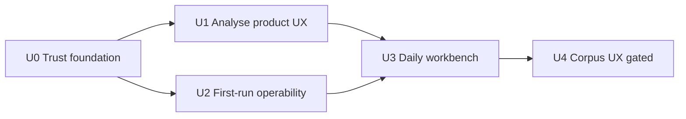

Type: PRODUCT
Authority: Usability-wave delivery plan (sequencing, tracks, acceptance criteria, exit gates). Does not define runtime schemas or contracts — those stay in CONTRACT docs. Companion to [ROADMAP.md](ROADMAP.md) and [product_hardening_plan.md](product_hardening_plan.md). Product language: **usability wave** (not “Wave 2” — Detection already uses that label).

# Usability wave plan

**Status:** [~] active — authoritative sequencing for the current product focus (ROADMAP **Now — Usability wave**). Analyse Phases 1–5 are done (**U0** landed via [PR #5](https://github.com/glen-w/transcribe/pull/5)); open tracks are **U1–U4**.

**Thesis:** Transcribe already has a complete core analysis set and durable OCR/analysis execution. Ordinary users still meet module-mechanics chrome, thin first-run guidance, and weak daily-workflow surfaces. This wave makes the workbench **trustworthy and usable end-to-end** — from install to export — without scheduling new analysis modules or deferred reinterpretations.

```text
Trust foundation          Daily workbench              Living corpus (gated)
(phases 3–6)       →      (onboard · review · read)  →  (inbox · bulk · search+)
```

Detection Prompt Hub / Detect UI remains a **parallel** track (draft PRs #4 / #6). It is not the centerpiece of this wave and must not steal naming (“Wave 2”).

---

## 1. Goals and non-goals

### Goals

1. **Trust without literacy** — Ordinary Analyse / Export workflows never require understanding module ids, cache identity, plan hashes, or capability enums.
2. **Honest health** — Every analysis surface answers the same question: “is this current and healthy?”
3. **Provenance** — Exports identify the notebook revision that produced them.
4. **First successful notebook** — A new user can install, pull a model, import, OCR, review, and export without reading contracts.
5. **Daily correction loop** — Review is a queue of work (dates, edits), not only a page browser.
6. **Living with notebooks** — Search, organisation, and reading improve on today’s project model; bulk inbox activates only after corpus contracts green.

### Non-goals (explicit)

| Out of scope | Why |
|--------------|-----|
| New analysis modules / deferred reinterpretations / `ocr_quality` | [ROADMAP.md](ROADMAP.md) deferral stands |
| OpenCV preprocess pipelines | Pillow-only policy |
| Cloud OCR providers | Product boundary |
| Treating Detection Wave 2 as this wave’s definition of done | Parallel track |
| Shipping supported bulk-import UI/CLI before the [corpus-integrity acceptance gate](contracts/corpus-integrity.md#acceptance-gate) | Contracts-first rule |
| Corpus-level Analyse / cross-notebook links / bookmarks | Later candidates |

### Naming

| Say | Do not say |
|-----|------------|
| Usability wave, tracks **U0–U4** | Wave 2 (reserved for Detection drafts) |
| Core modules | Wave 1 (internal history only — [analysis_wave1_plan.md](analysis_wave1_plan.md)) |
| Product views / status strip | “Module console”, “payload dump” as primary UI |

---

## 2. Relationship to existing work

| Artifact | Role in this wave |
|----------|-------------------|
| [product_hardening_plan.md](product_hardening_plan.md) Phases **3–5** (#5/#6/#11/#12/#13) | **U0** — **done** on `main` ([PR #5](https://github.com/glen-w/transcribe/pull/5)) |
| Hardening Phase **6** (#7–9) | **U1** — Analyse / OCR chrome simplification on top of shared health |
| [analysis_wave1_hardening_plan.md](analysis_wave1_hardening_plan.md) | Done infra; do not reopen as UI work |
| Detection drafts #4 / #6 | Parallel; coordinate only where Prompt Hub / page-viewer findings share chrome |
| Corpus contracts | **U4** product UX designed against contracts; runtime activation gated |

**Dependency rule:** Do not start U1 product-view cleanup that invents a second freshness model. Consume `AnalysisHealth` / `content_revision` from U0.



U2 may start in parallel with U1 once U0 is merged (onboarding does not depend on Analyse chrome). U3 prefers U1’s status-strip patterns. U4 implementation starts only after the corpus acceptance gate is green; UX design spikes may precede activation.

---

## 3. Track overview

| Track | Intent | Hardening IDs | Status |
|-------|--------|---------------|--------|
| **U0** — Trust foundation | Preset identity, plan-hash bind, content revision, shared health, export provenance | #5 #6 #11 #12 #13 | **[x] done** ([PR #5](https://github.com/glen-w/transcribe/pull/5)) |
| **U1** — Analyse product UX | Product views, shared status strip, OCR Advanced | #7 #8 #9 | Planned |
| **U2** — First-run & operability | Install path, sample notebook, model guidance, doctor/diagnostics in UI | — | Planned |
| **U3** — Daily workbench | Review queues, reading mode, search/org polish (no bulk corpus activation) | — | Planned |
| **U4** — Corpus UX (gated) | Inbox / import recovery / bulk import surfaces after acceptance gate | — | Planned / gated |

---

## 4. U0 — Trust foundation

**Outcome:** Users can trust exactly what a preset will run; every analysis surface shares one health answer; exports cite a notebook revision.

**Status:** **[x] done** on `main` via [PR #5](https://github.com/glen-w/transcribe/pull/5) (`cursor/hardening-phases-3-5-4764`). Hardening checklist rows #5/#6/#11/#12/#13 are closed.

### Deliverables (landed — do not fork semantics)

| ID | Deliverable | Contract authority |
|----|-------------|-------------------|
| #5 | Freeze `AnalysisRunPlan` + `plan_hash` at launch; start refuses mismatch; no live re-snapshot | [analysis-run-storage.md](contracts/analysis-run-storage.md) |
| #6 | Named presets `content_version` + policy fingerprint; Custom = module-list fingerprint | [workspace-settings.md](contracts/workspace-settings.md) |
| #11 | Hex `content_revision` over exportable page content | [project-on-disk.md](contracts/project-on-disk.md) |
| #12 | Derived `AnalysisHealth` shared across Overview / Themes / Mood / Moments / Summaries; Ask out of batch scope | [analysis-result.md](contracts/analysis-result.md) |
| #13 | Same `content_revision` on JSON, manifest, Markdown header, plaintext header | [notebook-export.md](contracts/notebook-export.md) |

### Acceptance

- Offline tests for plan-hash bind, preset version bumps, revision stability, health aggregate priority, export stamp coherence (landed with PR #5).
- ROADMAP hardening table marks Phases 3–5 `[x]`.
- Known limitations updated for health / plan_hash / preset versions / export stamps.
- **Does not** remove module-id banners or `st.json` dumps — that is U1.

### Key files

`src/transcribe/analysis/{plan,presets,coordinator,health}.py`, `domain/content_revision.py`, `services/export.py`, `ui/{run_analysis,analysis_health_view,app,settings_analysis}.py`, phase 3–5 tests, contracts listed above.

---

## 5. U1 — Analyse product UX (hardening Phase 6)

**Outcome:** Analyse and Transcribe surfaces read as **user tasks**, not module/OCR consoles. Builds on U0 health/revision.

Parse checklist parenthetical **#7–9** as three shippable items:

### #7 — Product views

Replace module-console chrome with task-shaped read-models.

| Surface | Primary content | Demote / hide from default path |
|---------|-----------------|----------------------------------|
| Overview | Counts, diversity, entities, theme chips, charts | Raw module ids as section titles; capability/`outcome=` banners; payload `st.json` |
| Themes | Topics, wordclouds, similarity narrative | Per-module JSON expanders |
| Mood & tone | Emotion / affect / hedging strips | Enum dumps |
| Moments | Salient quotes with jump-to-page | Internal module labels |
| Summaries | Highlights → summary → insights (and LLM when healthy) | Parent-cache literacy |
| Ask | Question + answer | Stale batch payloads; treat as ad-hoc (already) |
| Last run | Short product summary (“Balanced v3 · 12 modules · healthy”) | Per-module `outcome=` lists as default |

**Rules**

- Capability honesty stays, but in **product language** (“Needs a text model”, “Optional BERTopic not installed”, “Not enough text yet”) — not `unavailable_model` as first-class chrome.
- Power users may still open an **Advanced / technical details** expander per tab or once globally.
- Existing read-model helpers and `module_ui_groups` stay the composition layer; do not invent a second analysis runner.

### #8 — Status strip

One shared health strip (consume `render_aggregate_caption` / `AnalysisHealth` from U0):

- Placement: above Analyse result tabs (and optionally in Workflow Analyse header while a run is active).
- Answers: revision short prefix · aggregate state · whether a run is active/interrupted.
- Per-tab duplicate freshness banners collapse into the strip; tab bodies show content or a single empty/unavailable state.
- Ask caption continues to state it does not update batch health.

### #9 — OCR Advanced

Transcribe (Run OCR) primary chrome:

1. Vision model
2. Start transcription
3. Optional one-line cleanup toggle (or clearly secondary)

Collapse under **Advanced**: workers, force re-OCR, cleanup mode/model detail, unverified-identity tips, capability dumps, remote-host acknowledgement (keep safety-critical acknowledgement visible or confirm-gated — never bury the privacy footgun without a confirm).

### Acceptance (U1 exit)

- [ ] No ordinary Analyse path requires reading module ids or `st.json` to understand results.
- [ ] One status strip is the sole default freshness/health answer across batch tabs.
- [ ] Transcribe primary path is model + run (+ optional cleanup); power controls under Advanced.
- [ ] Acceptance / UI contract tests: `tests/unit/test_analyse_ui_contract.py` (extend) asserts product copy for common unavailable states; smoke on port 8510.
- [ ] [public_surfaces.md](public_surfaces.md) + [user_guide.md](user_guide.md) describe product views, not module consoles.
- [ ] Hardening Phase 6 and ROADMAP hardening **exit gate** close when U0+U1 acceptance tests pass.

### Key files

`src/transcribe/ui/app.py` (result tabs, Transcribe panel), `ui/analysis_health_view.py`, `ui/run_analysis.py`, `ui/module_ui_groups.py`, docs above, Analyse UI contract tests.

---

## 6. U2 — First-run & operability

**Outcome:** A motivated non-expert reaches a first exported notebook without digging into contracts or Docker archaeology.

### U2.1 — Guided first run (in-app)

| Step | Behavior |
|------|----------|
| Empty workspace | Notebooks empty state offers **Create notebook** + **Open sample** (U2.2) + link to install tips |
| Setup checklist | Collapsible panel: projects path writable · Ollama reachable · ≥1 vision model · (optional) text model |
| Model guidance | Recommend a known-good vision tag from discovery; Refresh invalidates cache; explain unverified identity cost |
| Privacy | Remote Ollama still requires acknowledgement; checklist flags non-loopback hosts |

No telemetric onboarding — local checklist state only (workspace settings or session).

### U2.2 — Sample / demo notebook

- Ship a small fixture notebook (few pages of public-domain or synthetic handwriting scans **or** text-backed pages with placeholder images) under a documented path (e.g. `samples/demo-notebook/` or generated into projects on demand).
- One-click **Open sample** copies into `TRANSCRIBE_PROJECTS_DIR` via existing `init` + import services — not a second project format.
- Sample should be analysable offline for deterministic modules (so Analyse demos without LLM).

### U2.3 — Diagnostics in UI

| Capability | Today | Target |
|------------|-------|--------|
| `doctor` | CLI only | **App → Diagnostics** (or Settings section): run project or workspace doctor; show human-readable pass/warn/fail with suggested next steps |
| Recovery | Contracts / terminal | Short copy for cache rebuild, interrupted analysis re-run, import failure (single-file path) |
| Runtime paths | Settings captions | Explain inbox/export mounts; do not imply inbox imports until U4 |

### U2.4 — Docs & install path

- Tighten [runtime/installation.md](runtime/installation.md) / [runtime/docker.md](runtime/docker.md) into a **“first notebook in 15 minutes”** path linked from README empty-state.
- Document port **8510**, absolute `HOST_PROJECTS_DIR`, Linux `extra_hosts`, UID/GID once in the first-run doc — not scattered only in deep runtime notes.
- Surface [known_limitations.md](known_limitations.md) items that bite first run (encrypted PDF, large budgets, cleanup latency).

### Acceptance (U2)

- [ ] Empty workspace presents create + sample + checklist without requiring docs.
- [ ] Sample notebook path works offline for import → (optional OCR skip if pre-seeded text) → Analyse Quick → Export.
- [ ] Doctor results visible in UI with actionable copy.
- [ ] README / user guide point at the first-run path; no contract reading required for the happy path.

### Key files

`ui/shell.py`, `ui/settings_hub.py`, new `ui/diagnostics.py` (or similar), `services/doctor.py`, `samples/` (new), README, `docs/runtime/*`, `docs/user_guide.md`.

---

## 7. U3 — Daily workbench

**Outcome:** After first success, living with one or many notebooks feels deliberate: correct faster, read comfortably, find things, organise lightly — **without** activating bulk corpus contracts.

### U3.1 — Review as a work queue

Today Review opens the shared page viewer with thin empty states ([app.py](src/transcribe/ui/app.py) Review section; [page_viewer.py](src/transcribe/ui/page_viewer.py)).

| Add | Detail |
|-----|--------|
| Needs-attention filters | Unapproved suggested dates · pages with no text · failed OCR · (optional) edited-vs-raw |
| Batch date actions | Approve/ignore visible suggestions for N pages with clear feedback |
| Faster edit loop | Keep ←/→; emphasize save affordance; reduce hover-only destructive controls where practical |
| Honesty | Time-of-day still ignored until Future metadata ships; unapproved dates still timeline-indexed — call out in Review chrome |

### U3.2 — Reading mode

Distinct from Review (edit) and Analyse:

- Chronological page image + text pairing, distraction-free chrome, jump-by-date when dates exist.
- Reuse page viewer data path; presentation mode / route under Notebooks or Workflow — no new on-disk format.
- Optional “continue reading” remembers last page in session or lightweight UI state (not a new contract).

### U3.3 — Search & Archive deepening (FTS, not corpus index)

Stay on rebuildable archive SQLite ([known_limitations.md](known_limitations.md)):

| Improvement | Notes |
|-------------|-------|
| Date range on Search | Archive already has period/range; bring coherent filters to Search |
| Clearer empty states | Distinguish “no notebooks” vs “no hits” vs “cache rebuilding” |
| Jump richness | Preserve highlight + open-in-viewer; raise discoverability of jump-to-page |
| Not yet | Entity filters, saved searches — design stubs OK; implement only if cheap on current FTS |

Do **not** treat `archive.sqlite` as backup authority (unchanged support policy).

### U3.4 — Notebook organisation polish

On existing `title` / `tags` / `cover_page_id` (no schema expansion required for MVP):

- View: cover thumbnails, tag chips, sort clarity, rename/delete discoverability (menus already exist — tighten empty/error copy).
- Optional soft fields only if contract bump is justified: short description — otherwise skip.
- Collections / archive-state / user sort order → defer to post-U4 or later candidates unless a tiny settings-only sort lands without corpus index.

### U3.5 — Model & runtime management (product abstraction)

Transcribe panel already lists/refreshes models. Deepen:

- Show availability, approximate size when known, last-used, verified vs unverified identity.
- Short recommendations for “first OCR” vs “quality” without hard-coding a single vendor promise.
- Text-model requirements for Analyse LLM modules explained in the same vocabulary as U1 product copy.

### Acceptance (U3)

- [ ] Review offers at least one needs-attention filter and batch date approve/ignore.
- [ ] Reading mode ships as a distinct presentation (documented in public surfaces).
- [ ] Search gains date-range (or documented parity with Archive filters) and clearer empties.
- [ ] Model panel explains verified identity and text-model needs in product language.
- [ ] No dependency on corpus index / ImportRun activation.

### Key files

`ui/page_viewer.py`, `ui/archive_views.py`, `ui/shell.py`, `ui/app.py`, `services/archive.py`, `docs/public_surfaces.md`, `docs/user_guide.md`.

---

## 8. U4 — Corpus UX (gated)

**Outcome:** After the [corpus-integrity acceptance gate](contracts/corpus-integrity.md#acceptance-gate) is green, ship the human continuation of bulk import: **inbox / import recovery** as the corpus home screen.

### Hard gate (do not violate)

Supported bulk-import UI/CLI and inbox-as-product require:

1. Corpus index writers + locks ([notebook-corpus.md](contracts/notebook-corpus.md))
2. ImportRun / plan / resume ([import-run.md](contracts/import-run.md))
3. Duplicate policy on commit ([source-asset.md](contracts/source-asset.md))
4. Corpus doctor checks + synthetic multi-notebook suite ([corpus-integrity.md](contracts/corpus-integrity.md))

Suggested eng order (from ROADMAP): index → ImportRun/plan → duplicate policy → corpus doctor → suite → **only then** bulk UI.

### Product UX (design against contracts; implement post-gate)

| Surface | Intent |
|---------|--------|
| **Inbox** | Scan `TRANSCRIBE_INBOX_DIR` (today path-only in Settings) into an ImportPlan; show imported / failed / duplicated / needs-review |
| **Recovery** | Resume interrupted ImportRun; explain skip_existing vs create_duplicate |
| **Corpus home** | Natural landing after a dump of scans — not only Workflow → Import uploader |
| **Doctor** | Deep corpus doctor from U2 diagnostics when index present |

### Pre-gate allowed work

- UX mock flows and copy in docs.
- Keep single-file uploader polished (U3).
- Do not market Settings inbox path as functional import.

### Acceptance (U4)

- [ ] Acceptance gate green before any “supported” bulk/inbox claim in public surfaces.
- [ ] Inbox workflow shows outcomes for imported / failed / duplicated / needs-review.
- [ ] Crash-injection and idempotency covered by corpus suite; doctor recovers index.
- [ ] ROADMAP corpus section moves from planned → done for the shipped slice; remaining lifecycle items (re-OCR compare/promote, backup/restore productization) stay candidates unless explicitly pulled in.

### Key files

`src/transcribe/corpus/*`, `services` import orchestration (new), `ui` inbox/recovery views (new), `settings_hub.py`, corpus contracts + tests under the integrity suite.

---

## 9. Parallel tracks (coordination only)

| Track | Coordination rule |
|-------|-------------------|
| Detection Wave 2 (PRs #4/#6) | May share page-viewer finding captions and Prompt Hub settings; must not redefine Analyse health or block U0–U1 |
| Visual declutter expansion | Remains ROADMAP preprocessing candidate; not required for usability-wave exit |
| Re-OCR compare/promote | Lifecycle candidate; U3 may link “force re-OCR” honesty but full compare/promote is post-wave unless pulled |
| Quality thumbs / prompt management UI | Candidates; Detection Prompt Hub may absorb prompt browse — do not duplicate |

---

## 10. Wave exit gates

### Hardening close (U0 + U1)

Matches [ROADMAP.md](ROADMAP.md) hardening exit gate:

- Crash/reopen, stale detection, offline operation, export provenance, and normal Analyse workflows covered by acceptance tests.
- No ordinary user workflow requires understanding module/cache internals.

### Usability-wave close (U0–U3; U4 gated separately)

| Gate | Evidence |
|------|----------|
| Trust | Phases 3–6 checklist `[x]`; UI contract tests green |
| First-run | Sample path + checklist + doctor UI documented and smoke-tested |
| Daily loop | Review queue + reading mode + search filter parity smoke-tested |
| Honesty | known_limitations + public_surfaces updated; inbox not oversold pre-U4 |
| Corpus | U4 either still gated with explicit “not supported” copy, or acceptance gate green and inbox shipped |

U4 may remain open after the usability wave is declared done for U0–U3; say so in ROADMAP status.

---

## 11. Documentation updates required as tracks land

| Doc | When |
|-----|------|
| [product_hardening_plan.md](product_hardening_plan.md) | U0/U1 status rows |
| [ROADMAP.md](ROADMAP.md) | Point **Now** at this plan; tick phases; move U2/U3 into active sequencing |
| [public_surfaces.md](public_surfaces.md) | Product views, Reading mode, Diagnostics, Inbox (only when supported) |
| [user_guide.md](user_guide.md) | First-run, Review queue, Reading |
| [known_limitations.md](known_limitations.md) | Health, presets, export revision, Review date caveats |
| [TERMS.md](TERMS.md) | `plan_hash`, `content_revision`, `AnalysisHealth` (landed with U0) |
| [USER_INDEX.md](USER_INDEX.md) / [DEV_INDEX.md](DEV_INDEX.md) / [index.md](index.md) | Link this plan |

---

## 12. Implementation checklist (track-level)

### U0
- [x] Land PR #5 (or equivalent) on `main`
- [x] Mark hardening Phases 3–5 done in ROADMAP + product_hardening_plan
- [x] Confirm offline phase 3–5 tests on `main`

### U1
- [ ] #8 Status strip wired as sole default health chrome
- [ ] #7 Product views for Overview / Themes / Mood / Moments / Summaries / Ask / Last run
- [ ] #9 OCR Advanced grouping with privacy acknowledgement preserved
- [ ] UI contract tests + docs; mark Phase 6 + hardening exit gate

### U2
- [ ] Empty-state checklist + model guidance
- [ ] Sample notebook one-click path
- [ ] Diagnostics / doctor UI
- [ ] First-run docs path from README

### U3
- [ ] Review needs-attention + batch dates
- [ ] Reading mode
- [ ] Search/Archive filter parity + empties
- [ ] Model management product copy

### U4 (gated)
- [ ] Corpus acceptance gate green
- [ ] Inbox / import recovery UI + CLI as supported surfaces
- [ ] Public docs claim bulk/inbox only after gate

---

## 13. Success metrics (qualitative)

This product does not ship analytics telemetry. Use local evidence:

1. Maintainer can complete sample → Analyse Quick → Export with LLM offline and without opening `st.json`.
2. Fresh install checklist catches missing Ollama / vision model before a mysterious OCR hang.
3. Review batch-approves a notebook of suggested dates in one pass.
4. Export artifacts share one `content_revision` a user can cite.
5. Settings inbox path is either clearly “not yet importing” or a real recovery home (never a dead caption).
